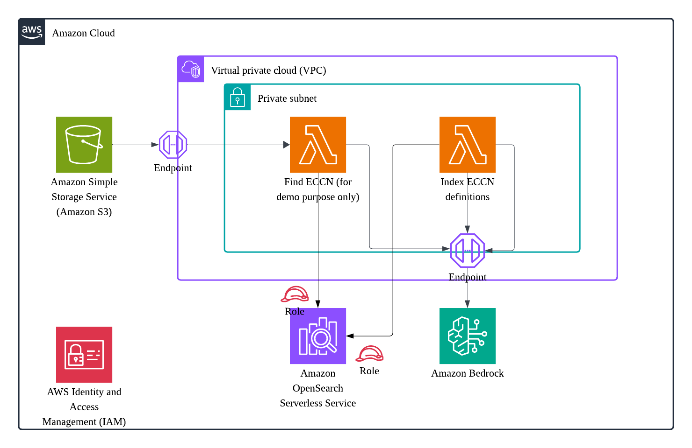

# ECCN Agent

A tool to help customers suggest Export Control Classification Numbers (ECCN) based on ECCN documentation.

## Background

Export Control Classification Numbers (ECCNs) are alphanumeric codes used in the Commerce Control List (CCL) to identify items for export control purposes. Determining the correct ECCN for products can be challenging due to the complex nature of export regulations and the technical specifications involved.

The ECCN Agent was developed to address this challenge by leveraging AI and semantic search capabilities to help customers identify appropriate ECCNs for their products. By analyzing product descriptions and comparing them against the Commerce Control List using vector embeddings, the system can suggest relevant classifications and simplify the export compliance process.

This tool aims to reduce the time and expertise required to navigate export control regulations while improving classification accuracy and consistency.

## Overview

The ECCN Agent analyzes product information and documentation to suggest appropriate Export Control Classification Numbers, helping customers navigate export compliance requirements. It uses Amazon Bedrock for embeddings generation and OpenSearch for semantic search capabilities to match product descriptions with the most relevant ECCN classifications.

## System Architecture




### AWS Resources Created

The ECCN Agent infrastructure creates the following AWS resources:

- **API Gateway**
  - Provides REST API endpoints for client applications to interact with the ECCN Agent
  
- **Lambda Functions**
  - `find_eccn`: Processes user requests and performs vector searches
  - `ccl_ingestion`: Ingests CCL data into OpenSearch with vector embeddings
  
- **OpenSearch Serverless**
  - Stores ECCN data and provides vector search capabilities
  
- **Amazon Bedrock**
  - Generates embeddings for semantic search using Cohere's embed-english-v3 model
  
- **VPC**
  - Provides network isolation for the Lambda functions and OpenSearch
  
- **IAM Roles**
  - Grants necessary permissions for services to interact with each other
  
- **CloudWatch Logs**
  - Captures logs from Lambda functions and API Gateway for monitoring
  
- **Lambda Layers**
  - Provides shared dependencies for Lambda functions

The infrastructure is defined as Infrastructure as Code (IaC) using the AWS Cloud Development Kit (CDK), making it reproducible and maintainable.

## Project Structure

```
eccn-agent/
├── infrastructure/           # CDK infrastructure code
│   ├── main.py              # Main CDK stack definition
│   ├── opensearch_serverless.py  # OpenSearch serverless configuration
│   ├── vpc_stack.py         # VPC configuration
│   └── helpers.py           # Helper functions for CDK
│
├── src/                     # Application source code
│   ├── lambdas/             # Lambda functions
│   │   ├── ccl_ingestion/   # Lambda for ingesting CCL data into OpenSearch
│   │   │   ├── handler.py   # Main handler for CCL ingestion
│   │   │   └── ccl_parsed_checked.json  # Parsed CCL data
│   │   │
│   │   └── find_eccn/       # Lambda for finding ECCN based on product description
│   │
│   └── lambda_layers/       # Shared code and dependencies for Lambda functions
│
├── tests/                   # Test files
├── sample_data/             # Sample data for testing
├── app.py                   # Main application entry point
├── create_layer.sh          # Script to create Lambda layers
└── requirements.txt         # Python dependencies
```

## Getting Started

### Prerequisites

- [AWS CLI](https://aws.amazon.com/cli/) configured with appropriate permissions
- [AWS CDK](https://aws.amazon.com/cdk/) installed
- [Node.js](https://nodejs.org/) and npm
- [Python](https://www.python.org/) 3.10+

### Installation

1. Clone the repository:
```bash
git clone https://gitlab.aws.dev/dmhong/eccn-agent.git
cd eccn-agent
```

2. Install dependencies and set up the projen project:
```bash
# Install projen globally if not already installed
npm install -g projen

# Install project dependencies (projen will handle both Python and CDK dependencies)
npx projen
```

3. Deploy the infrastructure:
```bash
# Synthesize the CloudFormation template
npx projen synth

# Deploy the stack
npx projen deploy
```

### Post-deployment Setup

After deploying the infrastructure, an additional step is required to run the Lambda function for CCL ingestion:
open lambda function console and find the lambda function starting with name ccl, run the lambda function once using "Test"


## Database Design

The ECCN Agent uses Amazon OpenSearch Serverless for storing and retrieving ECCN classifications. The database is designed for vector search capabilities to enable semantic matching between product descriptions and ECCN codes.

### OpenSearch Index Schema

The main index (`eccn`) has the following structure:

| Field Name | Type | Description |
|------------|------|-------------|
| eccn_code | keyword | The Export Control Classification Number (e.g., "1A001") |
| description | text | Detailed description of the ECCN classification |
| eccn_category | keyword | The main category of the ECCN (e.g., "1" for Materials) |
| product_group | keyword | The product group within the category (e.g., "A" for Systems) |
| eccn_category_detail | text | Detailed description of the category |
| product_group_detail | text | Detailed description of the product group |
| extra_details | text | Additional classification details and notes |
| content_embedding | knn_vector | 1024-dimensional vector representation of the ECCN entry |
| timestamp | date | When the entry was indexed |

### Vector Search Configuration

The OpenSearch index is configured with:
- HNSW (Hierarchical Navigable Small World) algorithm for efficient vector search
- Cosine similarity for vector comparisons
- 1024-dimensional vectors from Cohere's embed-english-v3 model via Amazon Bedrock

### Data Ingestion Process

The CCL ingestion Lambda function:
1. Loads the Commerce Control List (CCL) data from a parsed JSON file
2. Generates vector embeddings for each ECCN entry using Amazon Bedrock
3. Indexes the data into OpenSearch with proper mappings for vector search
4. Enables semantic search capabilities for finding relevant ECCN classifications

## Features

- Automated ECCN classification suggestions based on product descriptions
- Semantic search using vector embeddings for accurate matching
- Detailed ECCN information retrieval including categories and product groups
- Export compliance guidance based on CCL data
- Historical classification tracking

## How to improve your prompt

The ECCN Agent includes an automated prompt optimization system in `src/sagemaker/optimization_prompt.ipynb` that helps you iteratively improve classification accuracy. This notebook provides a systematic approach to prompt engineering with minimal manual effort.

### Automated Prompt Optimization

The `optimization_prompt.ipynb` notebook offers a complete workflow for prompt improvement:

1. **Data Preparation**
   - Load test cases with ground truth ECCN values from your dataset
   - Extract the current prompt template that will serve as your baseline
   - Organize product descriptions, documentation, and expected classifications

2. **Baseline Evaluation**
   - Process each test case using the current prompt
   - Compare model-generated ECCN classifications with ground truth values
   - Calculate initial success rates and identify error patterns
   - Generate baseline performance metrics

3. **Visualization and Analysis**
   - Generate interactive performance visualizations showing success/failure rates
   - Analyze where the current prompt succeeds and fails
   - Identify patterns in misclassifications
   - Track performance metrics across different product categories

4. **Automated Iteration**
   - Improve the prompt based on performance analysis
   - Test the improved prompt against the same dataset
   - Compare results with previous iterations
   - Visualize improvement across iterations with progress charts

The notebook automatically tracks success rates across multiple prompt iterations, providing clear visualizations of performance improvements. This data-driven approach ensures that each prompt refinement is measurably better than the previous version.

By using this automated system, you can rapidly iterate through prompt variations and identify the optimal formulation for accurate ECCN classification with minimal manual effort.


## Security

This project implements AWS security best practices including:

- IAM roles with least privilege
- Encryption at rest and in transit for OpenSearch data
- Secure API access controls via API Gateway
- VPC isolation for sensitive components
- Regular security updates

## Contributing

See [CONTRIBUTING.md](CONTRIBUTING.md) for details on our code of conduct and the process for submitting pull requests.

## License

This project is licensed under the [LICENSE](LICENSE) - see the file for details.

## Team

- Project Owner: [Your Name]
- Contributors: [Team Members]
